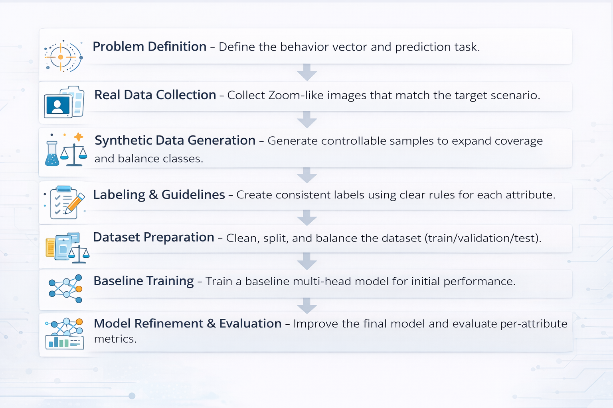

# Zoom Behavior Insight

Detecting study-focus signals from Zoom-like webcam frames using a **multi-task Computer Vision** model.  
From a single frame, the model predicts an interpretable **behavior vector** across five tasks:

- **Gaze**: `camera` / `not_camera` / `eyes_closed`
- **Headphones**: `with_headphones` / `without_headphones` / `unknown`
- **Environment**: `indoor` / `outdoor`
- **Privacy**: `private` / `public`
- **Object in hand**: `none` / `cup` / `phone` / `pen` / `other` / `unknown`

---

## Project motivation

In remote learning, a single screenshot often hides critical context: whether the student is attentive, the environment is appropriate, and whether distractions exist.  
This project aims to extract **interpretable study-focus signals** from a single Zoom-like frame and output them as a compact behavior vector.

---

## Problem statement

Given one webcam-like image, predict a **set of behavioral + environmental attributes** (multi-task classification) instead of relying on a single signal (e.g., only gaze).  
The output must be **human-readable** and reproducible for quick evaluation and demo.

---

## Visual abstract

> Add/replace the image below with your project visual abstract (recommended location: `visuals/visual_abstract.png`).



---

## Datasets used or collected

This project combines:
- **Real images**: Zoom-like webcam frames collected/curated for the project.
- **Synthetic images**: generated to increase coverage and improve class balance.

Labels are stored as a **behavior vector** with 5 tasks per image:
`gaze`, `headphones`, `environment`, `privacy`, `object`.

> The full dataset is hosted externally (see `data/README.md` for structure and access details).  
> This repository contains only **small samples / documentation** to keep the repo lightweight.

---

## Data augmentation and generation methods

To improve coverage of rare conditions and increase diversity, the project includes synthetic data creation and augmentation such as:
- **Text-to-image generation** for Zoom-like scenes with controlled attributes
- **Inpainting / editing** to enforce specific properties (e.g., object-in-hand, headphones)
- **Background replacement** to control environment/privacy cues
- **Balancing** across classes per task (especially for rare object categories)

Details and examples are documented under:
- `notebooks/` (experiments + generation workflows)
- `docs/` (labeling and project notes)

---

## Models and pipelines used

### Backbone (final model)
The final model uses a **DeiT (Data-efficient Image Transformer)** backbone with **multiple classification heads** (one head per task).  
This enables **multi-task inference** while keeping outputs interpretable.

### Tasks and classes
- **Gaze**: `camera`, `not_camera`, `eyes_closed`
- **Headphones**: `with_headphones`, `without_headphones`, `unknown`
- **Environment**: `indoor`, `outdoor`
- **Privacy**: `private`, `public`
- **Object**: `none`, `cup`, `phone`, `pen`, `other`, `unknown`

Label mappings and constants are defined in:
- `scripts/label_utils.py`

---

## Training process and parameters (summary)

Training is performed as multi-task classification:
- **Shared backbone** + **5 heads**
- Standard CV preprocessing and normalization
- Evaluation performed per-task and aggregated for reporting

Full training/evaluation code and experiment logs are in:
- `notebooks/`

> Exact hyperparameters (epochs / LR / batch size / optimizer / loss setup) are documented in the relevant notebooks.

---

## Metrics

Evaluation is reported per task using common classification metrics, such as:
- **Accuracy** (per task)
- (Optional, if used in your notebooks) **F1 / Macro-F1**
- Confusion matrices for per-class analysis

Metric tables/plots are located under:
- `results/`

---

## Results

Key outputs of experiments and evaluation are provided under:
- `results/` — plots, tables, confusion matrices, per-task metrics
- `visuals/` — selected figures for documentation/presentation

> See `results/README.md` for a guided overview of the reported metrics and figures.

---

## Input/Output examples

### Input (demo images)
- `assets/demo_images/web_019.jpg`
- `assets/demo_images/synth_00097.jpg`

### Output (example format)
For each image, the script prints predictions for:
- `gaze`, `headphones`, `environment`, `privacy`, `object`

Example (illustrative):
- `gaze: camera`
- `headphones: without_headphones`
- `environment: indoor`
- `privacy: private`
- `object: phone`

---

## Repository structure

This repository is organized into clear, review-friendly folders:

- `scripts/` — standalone Python scripts (demo inference + utilities)
- `assets/` — small demo assets needed to run the demo
- `weights/` — weight instructions (weights are not stored directly in repo)
- `notebooks/` — experiments, training/evaluation notebooks
- `results/` — evaluation outputs (plots, tables, metrics)
- `docs/` — additional documentation (labeling guidelines, notes)
- `data/` — small labeled samples / dataset structure documentation
- `presentations/` — project presentations (PPT + PDF)
- `visuals/` — figures and visual abstract

> Each folder contains its own `README.md` with details.

---

## Quick demo (recommended)

The easiest way to run inference is via the **Demo ZIP Release**, which includes:
- `scripts/` (demo inference code)
- `assets/demo_images/` (2 demo images)
- `weights/val_best.pth` (required checkpoint)

### Option A: Run via Demo ZIP (no repo clone)

1. Open **Releases** in this repository.
2. Download: `ZoomBehaviorInsight_Demo.zip`
3. Extract it.

Important: run from the **extracted folder root** (the folder that contains `scripts/`, `assets/`, `weights/`).

Install dependencies:
```bash
pip install torch torchvision timm pillow pandas
```

Run inference:
```bash
python scripts/inference.py
```

### Expected output
The script prints predictions for each demo image:
- `assets/demo_images/web_019.jpg`
- `assets/demo_images/synth_00097.jpg`

For each image it prints predictions for:
- `gaze`
- `headphones`
- `environment`
- `privacy`
- `object`

### Common issue: FileNotFoundError
If you see `Image not found` / `FileNotFoundError`, it usually means you did **not** run from the extracted root folder.

✅ Correct: run from the folder that contains `scripts/`, `assets/`, `weights/`  
❌ Wrong: run from inside `scripts/` or any subfolder

---

### Option B: Run from the repository (clone)

1. Clone the repository.
2. Ensure demo images exist:
   - `assets/demo_images/web_019.jpg`
   - `assets/demo_images/synth_00097.jpg`
3. Add model weights:
   - place `val_best.pth` at: `weights/val_best.pth`
4. Install dependencies (same as above), then run from the repository root:
```bash
python scripts/inference.py
```

> See `scripts/README.md`, `assets/README.md`, `assets/demo_images/README.md`, and `weights/README.md` for folder-level instructions.

---

## Team members
- Ofir Duek
- Rotem Aloni
- Aviv Meir

---

## What’s included vs. not included

### Included in this repository
- Code (`scripts/` + `notebooks/`)
- Documentation and slides (`docs/`, `presentations/`)
- Demo assets (small set in `assets/`)
- Results and figures (`results/`, `visuals/`)

### Not included in this repository
- Full training/evaluation dataset (hosted externally)
- Additional training checkpoints (not required for inference)

---

## Notes for reviewers (TA / Lecturer)
- The **Demo ZIP Release** is the recommended way to reproduce inference quickly.
- Full training pipeline, ablations, and experiments are documented in `notebooks/`.
- Results (metrics/plots) are centralized in `results/`.
